# Upload AutopilotInfo to blob storage
Upload Autopilot Hardware hash to Azure Blob Storage

## Generate SAS Token

- Go to the storage account

- Create a new container
  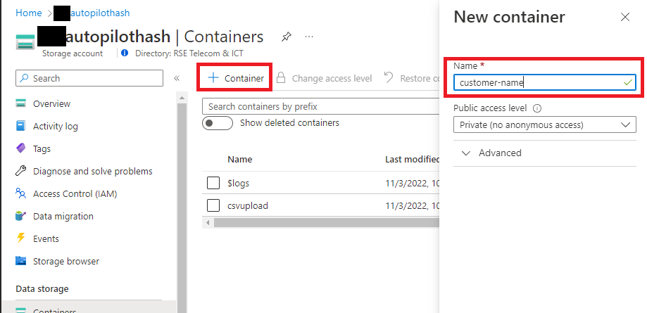

- Open the created container and click Shared access tokens
  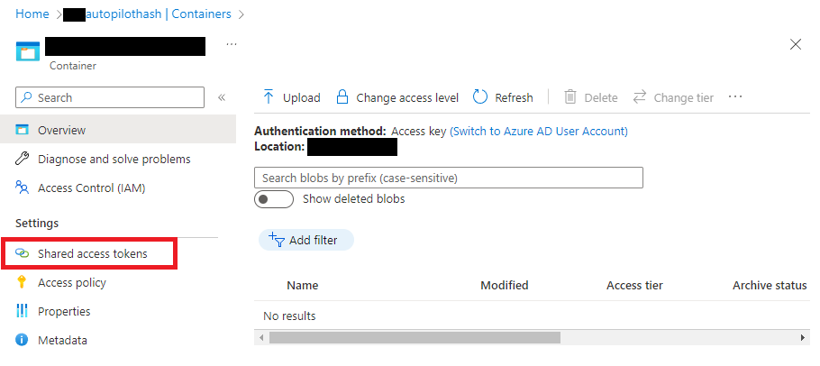

- Generate a SAS URL
  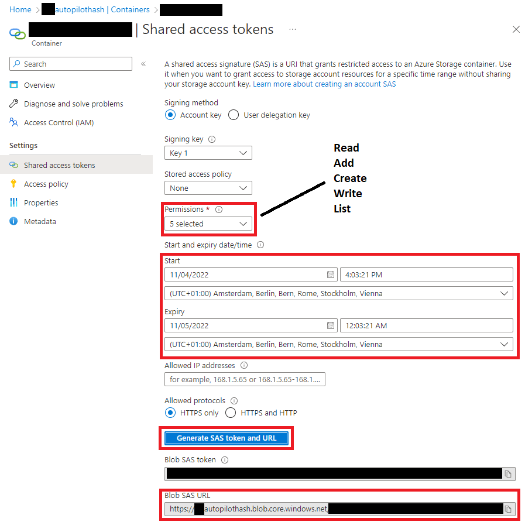

## Create task in Datto RMM

- Go to Datto RMM and create a [new job](https://pinotage.rmm.datto.com/job)
  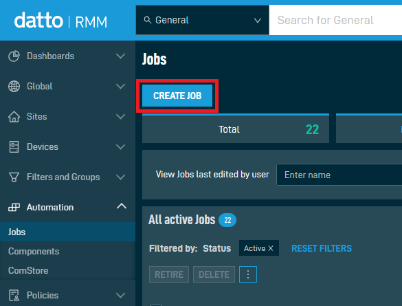

- Name the job and add a component
  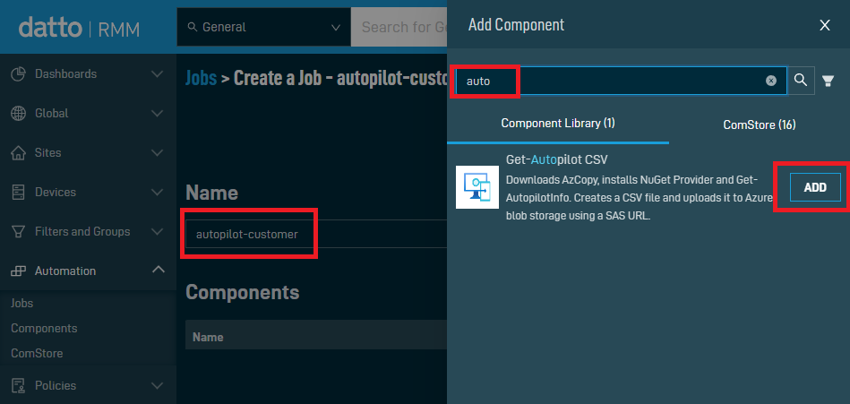

- Provide the earlier created SAS URL
  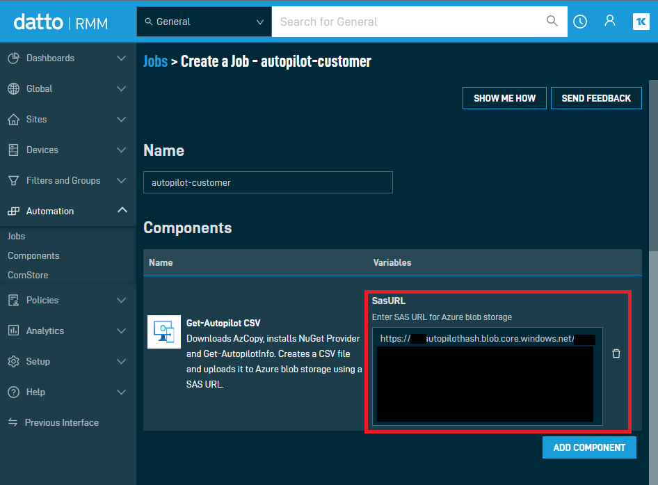

- Add the targets
  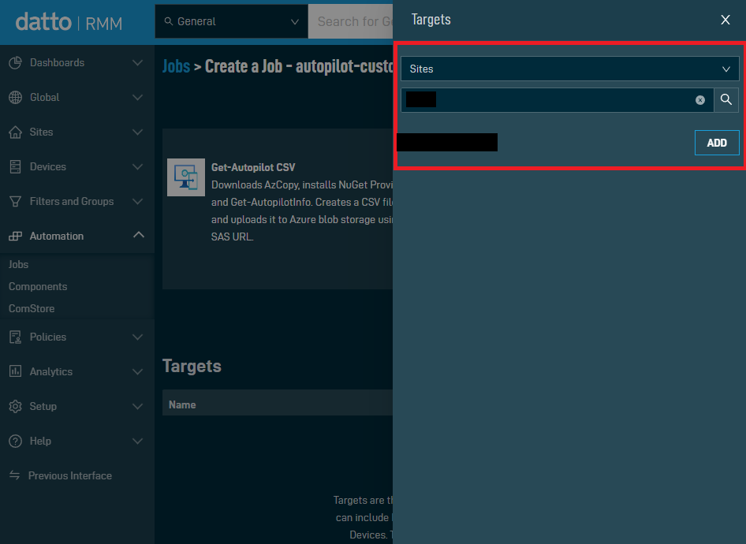

- Set the schedule and the duration
  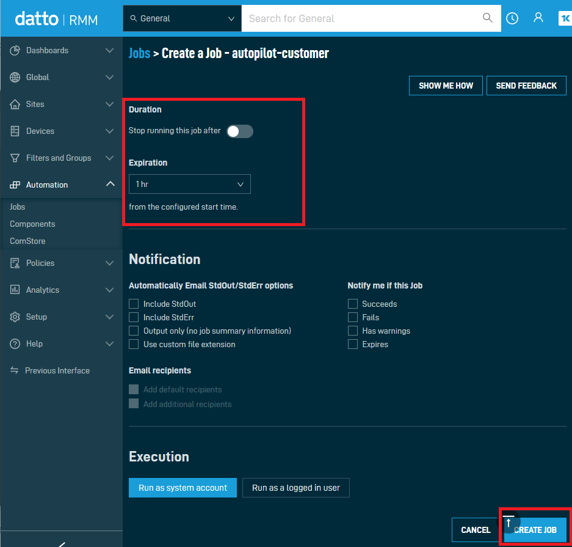

- Monitor the [job status](https://pinotage.rmm.datto.com/jobs/)
  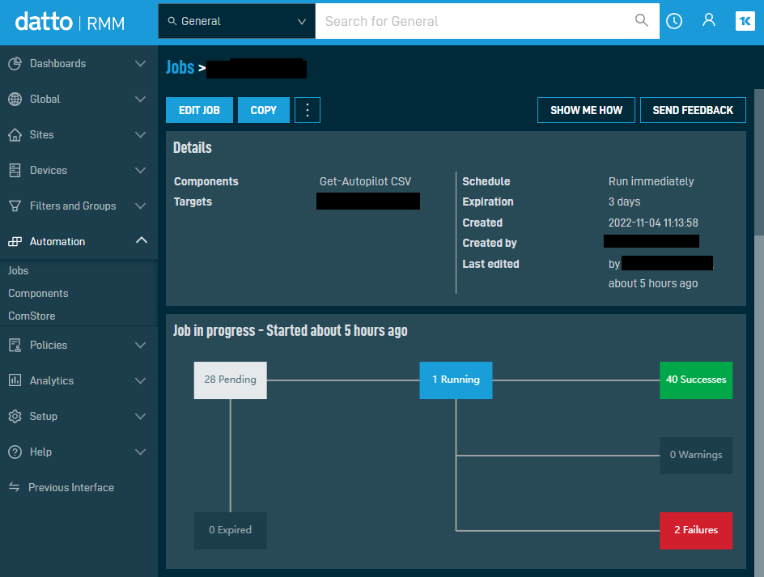

## Get the CSV's

- Watch the blob container fill with CSV files
  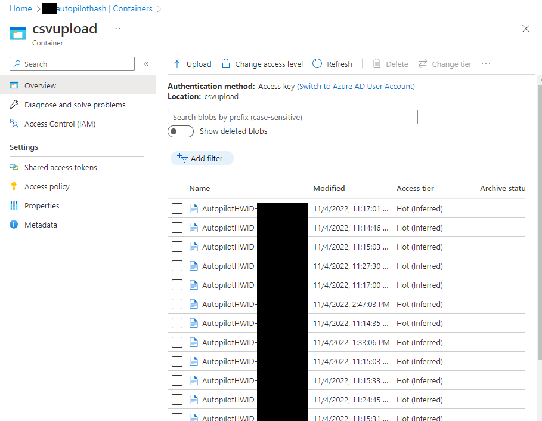

- Download the CSV's with [Azure Storage Explorer](https://go.microsoft.com/fwlink/?LinkId=708343&clcid=0x409)
  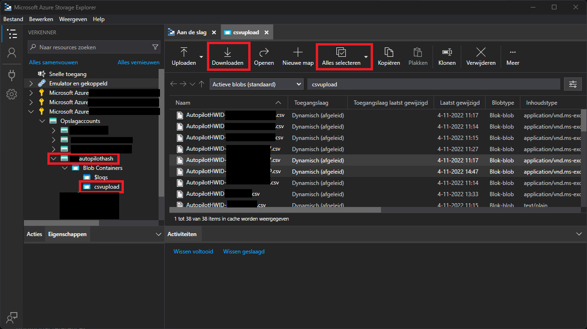

## Merge CSV's  

- Run the merge-csv.ps1 script in this repository
- Select the source folder where you downloaded the CSV's
- Select the destintion folder where you want the merged CSV to be stored

## Final actions

- Upload the merged CSV to the tenant!
